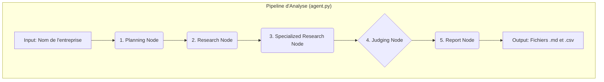
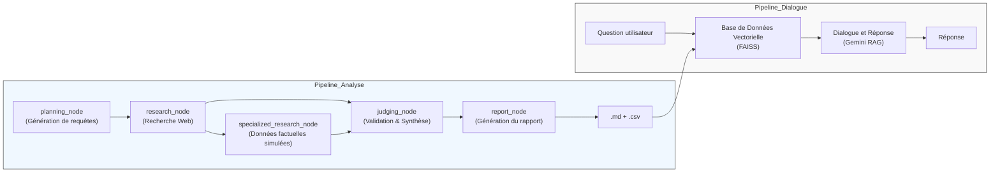

# Projet d'Analyse Concurrentielle Automatisée avec Agents IA

## Objectif du Projet

Ce projet met en œuvre un système multi-agents pour automatiser la collecte, la validation et la synthèse d'informations dans le cadre d'une analyse concurrentielle. Il est complété par un système de dialogue (RAG) permettant d'interroger les résultats des analyses sauvegardées.

Le projet est divisé en deux pipelines principaux :

1.  **Pipeline d'Analyse (agent.py + main.py) :** Un graphe d'agents qui effectue la recherche et génère un rapport sur une entreprise cible.
2.  **Pipeline de Dialogue (rag_query.py) :** Un système RAG qui permet de poser des questions sur les rapports déjà générés.

---

## 1. Pipeline d'Analyse : de la Requête au Rapport

Ce pipeline est orchestré par `main.py` et exécute la logique définie dans `agent.py`.

### Architecture et Technologies

- **Orchestration :** LangGraph (pour créer un graphe d'agents avec des étapes définies).
- **LLM :** Google Gemini (`gemini-1.5-flash`) pour le raisonnement et la génération de texte.
- **Recherche Web :** API Tavily pour une collecte d'informations approfondie.
- **Configuration :** Les clés API (`GEMINI_API_KEY`, `TAVILY_API_KEY`) doivent être définies dans un fichier `.env`.

### Déroulement du Pipeline

Le processus est une séquence de nœuds définis dans le graphe LangGraph :

1.  **`planning_node` (Planification) :**

    - **Input :** Un nom d'entreprise (ex: "Devoteam").
    - **Action :** Le LLM génère une liste de 5 à 7 requêtes de recherche web ciblées pour couvrir les aspects clés d'une analyse concurrentielle (identité, services, publications, etc.).

2.  **`research_node` (Recherche Web) :**

    - **Input :** La liste de requêtes de recherche.
    - **Action :** Exécute chaque requête via l'API Tavily et collecte les résultats bruts (URLs et contenus).

3.  **`specialized_research_node` (Recherche Spécialisée - Simulation) :**

    - **Input :** Le nom de l'entreprise.
    - **Action :** Ce nœud **simule** un appel à une API de données d'entreprise (type Crunchbase). Il retourne des données factuelles structurées (date de création, financement, etc.) depuis une base de données interne au code.
    - **Note :** Ce nœud est un _placeholder_ destiné à être remplacé par un véritable appel API.

4.  **`judging_node` (Jugement et Validation) :**

    - **Input :** Les données de la recherche web (Source 1) et les données factuelles simulées (Source 2).
    - **Action :** C'est le cœur de la validation. Le LLM agit comme un "juge" pour :
      - Comparer les informations des deux sources.
      - Donner la priorité aux données factuelles de la source spécialisée.
      - Utiliser la recherche web pour le contexte qualitatif.
      - Résoudre les contradictions et produire une **synthèse unique et validée**.

5.  **`report_node` (Génération du Rapport) :**
    - **Input :** La synthèse validée par le juge.
    - **Action :** À partir de cette source de vérité unique, le LLM génère deux livrables :
      1.  Un **rapport d'analyse complet** au format Markdown.
      2.  Des **données structurées** au format JSON, qui sont ensuite sauvegardées en CSV.

### Comment l'utiliser

1.  Assurez-vous que votre fichier `.env` contient les clés `GEMINI_API_KEY` et `TAVILY_API_KEY`.
2.  Modifiez la variable `company_to_analyze` dans `main.py` avec le nom de l'entreprise souhaitée.
3.  Exécutez le script :
    ```bash
    python main.py
    ```
4.  Les fichiers de sortie (`.md` et `.csv`) seront créés dans le répertoire racine avec un horodatage.

---

## 2. Pipeline de Dialogue : Interrogez vos Analyses (RAG)

Ce pipeline est contenu dans `rag_query.py` et fonctionne de manière indépendante. Son but est de vous permettre de poser des questions en langage naturel sur les rapports que vous avez générés.

### Architecture et Technologies

- **Framework RAG :** LangChain.
- **Base de Données Vectorielle :** FAISS.
- **Embeddings :** `sentence-transformers/all-MiniLM-L6-v2` (modèle Hugging Face).
- **LLM :** Google Gemini (`gemini-1.5-flash`).

### Déroulement du Pipeline

1.  **Création de la Base de Données (si elle n'existe pas) :**

    - Au premier lancement, le script scanne le répertoire à la recherche de tous les fichiers `.md` et `.csv`.
    - Il charge leur contenu, le divise en fragments (`chunks`), et le convertit en vecteurs numériques (embeddings).
    - Ces vecteurs sont stockés localement dans un répertoire `vectorstore/db_faiss`.

2.  **Dialogue et Réponse :**
    - Le script charge la base de données vectorielle existante.
    - Lorsque vous posez une question :
      a. La question est convertie en vecteur.
      b. Le système recherche les fragments de documents les plus similaires dans la base FAISS (recherche de similarité sémantique).
      c. Ces fragments pertinents sont injectés dans un prompt avec votre question et envoyés au LLM.
      d. Le LLM utilise ce contexte pour formuler une réponse précise et factuelle, basée uniquement sur les documents fournis.

### Comment l'utiliser

1.  Assurez-vous d'avoir déjà généré au moins un rapport d'analyse avec `main.py`.
2.  Exécutez le script de dialogue :
    ```bash
    python rag_query.py
    ```
3.  Le script créera la base de données vectorielle au premier lancement.
4.  Posez vos questions directement dans le terminal. Tapez `exit` pour quitter.

---

## 3. Visualisation des Pipelines

### Pipeline d'Analyse (agent.py)

Ce graphe illustre le processus de collecte, de validation et de génération de rapport pour une entreprise cible.



### Pipeline de Dialogue (rag_query.py)

Ce graphe montre comment le système RAG permet d'interroger les rapports déjà générés.


